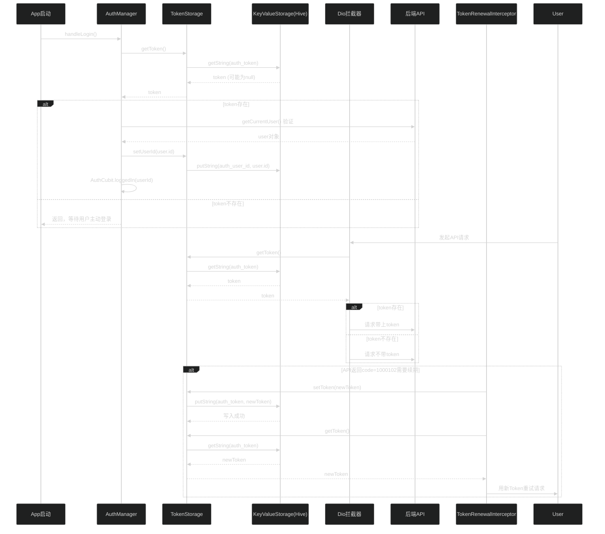

# Flutter 项目骨架 (Spine)

[](https://github.com/Kayouyou/spine-flutter/actions/workflows/ci.yml)
[](https://github.com/Kayouyou/spine-flutter/network/dependencies)
[](./LICENSE)


一个基于 Clean Architecture 的 Flutter 多包项目骨架，提供分层架构、最佳实践和开发工具。
**Monorepo · 显式 DI · AI 友好 · 公共维护。**

[快速开始](#快速开始) · [目录结构](#目录结构) · [架构评分](#架构评分) · [Mason 模板](#mason-代码模板) · [维护](#维护)

---

## 目录

- [项目简介](#项目简介)
- [目录结构](#目录结构)
- [快速开始](#快速开始)
- [我要加一个页面](#我要加一个页面)
- [分层决策树](#分层决策树)
- [测试命令](#测试命令)
- [Make 命令参考](#make-命令参考)
- [开发工具](#开发工具)
- [环境配置](#环境配置)
- [资源管理（flutter_gen）](#资源管理flutter_gen)
- [主题系统（Theme）](#主题系统theme)
- [列表缓存](#列表缓存)
- [架构评分](#架构评分)
- [Melos 多包管理](#melos-多包管理)
- [Mason 代码模板](#mason-代码模板)
- [监控与更新](#监控与更新)
- [路由守卫](#路由守卫)
- [DI 注入流程](docs/di-injection-flow.md)
- [Domain 测试](#domain-测试)
- [Login/Register 示例](#loginregister-示例)
- [测试覆盖率](#测试覆盖率)
- [Solo + AI 开发指南](docs/solo-ai-scaffold-guide.md)

---

## 项目简介

本项目是 **Flutter 移动应用骨架**，采用 **Clean Architecture + Feature-First** 架构：
- **domain**：纯 Dart 业务领域（无 Flutter 依赖）
- **features**：功能模块（cubit + repository + ui）
- **infrastructure**：基础设施（API、路由、本地存储）
- **services**：共享服务（认证、网络状态、多语言）

---

## 目录结构

```
spine_flutter/
├── lib/                          # 主应用
│   ├── main.dart                 # 入口文件
│   ├── app.dart                  # 主应用 Widget
│   ├── config.dart               # 全局配置
│   ├── core/                     # 核心模块
│   │   ├── di/                    # 依赖注入（locator.dart, setup.dart）
│   │   ├── startup/               # 启动流程（launcher, profiler, initializer）
│   │   ├── l10n/                  # 国际化生成文件
│   │   ├── utils/                 # 工具类（logger）
│   │   └── widgets/               # 全局组件（网络状态 banner 等）
│   └── theme/                    # 主题配置
│
├── packages/                     # 本地包（Monorepo）
│   ├── domain/                   # ┄┄┄┄┄┄┄┄┄┄┄┄┄┄┄┄┄┄┄┄┄┄┄┄┄┄┄┄┄┄┄┄┄┄┄┄
│   │   └── lib/
│   │       └── src/
│   │           ├── models/       # 领域模型（User, Todo 等）
│   │           ├── repositories/ # 仓储接口（抽象类）
│   │           ├── usecases/     # 用例（业务编排）
│   │           ├── enums/        # 枚举定义
│   │           └── exceptions/   # 领域异常（sealed class）
│   │
│   ├── infrastructure/            # ┄┄┄┄┄┄┄┄┄┄┄┄┄┄┄┄┄┄┄┄┄┄┄┄┄┄┄┄┄┄┄
│   │   ├── api/                  # Dio HTTP 封装
│   │   ├── routing/              # GoRouter 路由模块
│   │   ├── key_value_storage/    # Hive 本地存储
│   │   ├── list_cache/           # 列表缓存策略
│   │   └── component_library/    # 共享 UI 组件
│   │
│   ├── services/                 # ┄┄┄┄┄┄┄┄┄┄┄┄┄┄┄┄┄┄┄┄┄┄┄┄┄┄┄┄┄┄┄
│   │   ├── auth/                 # 认证服务
│   │   ├── network/              # 网络状态（NetworkCubit）
│   │   ├── locale/               # 多语言服务（LocaleCubit）
│   │   ├── data_sync/            # 数据同步
│   │   └── error/                # 错误处理
│   │
│   └── features/                 # ┄┄┄┄┄┄┄┄┄┄┄┄┄┄┄┄┄┄┄┄┄┄┄┄┄┄┄┄┄┄┄
│       ├── feature_home/        # 示例功能：首页
│       │   ├── lib/
│       │   │   ├── feature_home.dart       # 导出入口
│       │   │   ├── di/                      # DI 注册（setupFeatureXxx）
│       │   │   ├── cubit/                   # 状态管理
│       │   │   ├── repository/              # Repository 实现
│       │   │   ├── ui/                      # 页面 Widget
│       │   │   └── models/                  # Feature 本地模型
│       │   └── test/
│       └── feature_detail/      # 示例功能：详情页
│
├── makefile                     # 开发命令
├── melos.yaml                   # Melos 多包管理配置
├── mason.yaml                   # Mason 代码模板配置
├── pubspec.yaml                 # 主应用依赖
├── l10n.yaml                    # 国际化配置
│
├── env/                         # 环境变量文件
│   ├── .env.dev                 # 开发环境
│   ├── .env.staging             # 预发布环境
│   └── .env.prod                # 生产环境
│
├── assets/                      # 静态资源
│   ├── icon.png                 # 应用图标
│   ├── splash.png               # 启动页图片
│   ├── images/                  # 图片资源
│   └── fonts/                   # 字体资源
│
├── bricks/                      # Mason 代码模板
│   └── feature/                 # Feature 模板
│
└── docs/                        # 文档
```

### 各层职责速查

| 目录 | 职责 | 依赖 Flutter？ |
|------|------|--------------|
| `packages/domain/` | 纯业务：模型、仓储接口、用例、枚举、异常、**IAppConfig** | ❌ 否 |
| `packages/infrastructure/` | 技术：API、路由、存储 | ⚠️ 仅技术栈 |
| `packages/services/` | 共享状态：AuthCubit、NetworkCubit、LocaleCubit | ✅ 是 |
| `packages/features/` | 功能模块：一个功能一个包 | ✅ 是 |
| `lib/` | 组装：main.dart、DI 编排、路由绑定、**EnvAppConfig** | ✅ 是 |

---

## 快速开始

```bash
# 0. 安装 Melos（首次）
dart pub global activate melos

# 1. 安装依赖（Melos 自动扫描所有包）
make get

# 2. 运行调试（自动选择设备）
make debug

# 2.1 运行到模拟器（推荐）
make debug-simulator

# 3. 分析代码
make lint

# 4. 运行测试
make test
```

---

## 我要加一个页面

完整示例：假设我们要添加「设置页面」。

### 快速方式：一行命令

```bash
make create-feature name=settings
```

自动执行三步：生成文件 → `melos bs` 安装依赖 → `build_runner` 生成 freezed 代码。

完成后 RouteModule 自动注册，DI 需在 `lib/core/di/setup.dart` 中显式注册一行（见手动方式步骤 8）。

> 详细用法见 [Mason 代码模板](#mason-代码模板) 章节。

### 手动方式（传统步骤）

### 步骤 1：创建 Feature 包

在 `packages/features/` 下创建 `feature_settings/`：

```
feature_settings/
├── pubspec.yaml
├── lib/
│   ├── feature_settings.dart          # 导出入口
│   ├── di/
│   │   └── setup.dart                  # DI 注册
│   ├── cubit/
│   │   ├── settings_cubit.dart         # 状态管理
│   │   └── settings_state.dart
│   ├── repository/
│   │   └── settings_repository.dart    # 数据访问
│   ├── ui/
│   │   └── settings_page.dart          # 页面
│   └── models/                         # 本页面专用模型
│       └── settings_data.dart
└── test/
    └── settings_cubit_test.dart
```

### 步骤 2：定义 Model（domain 层）

如果需要共享模型，放在 `packages/domain/lib/src/models/`：

```dart
// packages/domain/lib/src/models/settings_data.dart
class SettingsData {
  final bool darkMode;
  final String language;

  const SettingsData({this.darkMode = false, this.language = 'zh'});
}
```

### 步骤 3：定义 Repository 接口（domain 层）

```dart
// packages/domain/lib/src/repositories/settings_repository.dart
abstract class SettingsRepository {
  Future<SettingsData> getSettings();
  Future<void> saveSettings(SettingsData data);
}
```

### 步骤 4：实现 Repository（feature 层）

```dart
// packages/features/feature_settings/lib/repository/settings_repository_impl.dart
class SettingsRepositoryImpl implements SettingsRepository {
  final KeyValueStorage _storage;
  
  SettingsRepositoryImpl(this._storage);

  @override
  Future<SettingsData> getSettings() async {
    // 从本地存储读取
  }

  @override
  Future<void> saveSettings(SettingsData data) async {
    // 保存到本地存储
  }
}
```

### 步骤 5：实现 Cubit（feature 层）

```dart
// packages/features/feature_settings/lib/cubit/settings_cubit.dart
class SettingsCubit extends Cubit<SettingsState> {
  final SettingsRepository _repository;
  
  SettingsCubit(this._repository) : super(const SettingsState());

  Future<void> loadSettings() async {
    emit(state.copyWith(status: SettingsStatus.loading));
    try {
      final data = await _repository.getSettings();
      emit(state.copyWith(data: data, status: SettingsStatus.loaded));
    } catch (e) {
      emit(state.copyWith(error: e, status: SettingsStatus.error));
    }
  }
}
```

### 步骤 6：DI 注册（feature 层）

```dart
// packages/features/feature_settings/lib/src/di/setup.dart
void setupFeatureSettings(GetIt sl) {
  // 注册仓储实现
  sl.registerFactory<SettingsRepository>(
    () => SettingsRepositoryImpl(sl<KeyValueStorage>()),
  );
  
  // 注册 Cubit
  sl.registerFactory<SettingsCubit>(
    () => SettingsCubit(sl<SettingsRepository>()),
  );
  
  // 路由注册：通过闭包把 cubit 工厂传给 RouteModule
  RouteModuleRegistry.instance.register(
    'feature_settings',
    (ctx) => SettingsRouteModule(
      ctx,
      createCubit: () => sl<SettingsCubit>(),
    ),
  );
}
```

### 步骤 7：添加路由模块（infrastructure 层）

```dart
// packages/features/feature_settings/lib/src/routes/settings_route_module.dart
class SettingsRouteModule extends RouteModule {
  final SettingsCubit Function() createCubit;

  const SettingsRouteModule(
    super.ctx, {
    required this.createCubit,
  });

  @override
  List<RouteBase> build() {
    return [
      GoRoute(
        path: '/settings',
        pageBuilder: (context, state) {
          Widget page = BlocProvider(
            create: (_) => createCubit()..loadSettings(),
            child: const SettingsPage(),
          );
          if (ctx.routeWrapper != null) {
            page = ctx.routeWrapper!(page);
          }
          return MaterialPage(child: page);
        },
      ),
    ];
  }
}
```

### 步骤 8：添加根依赖 + 显式注册

当前项目的唯一推荐做法：

1. 在根 `pubspec.yaml` 添加 path 依赖
2. 在 `lib/core/di/setup.dart` 添加 import
3. 调用 `FeatureRegistry.instance.register('feature_settings', setupFeatureSettings);`
4. 保持 `FeatureRegistry.instance.runAll(sl);` 作为统一执行入口

> 不再依赖 import 副作用自动注册。

### 步骤 9：运行

```bash
make get
make debug-simulator
```

---

## 分层决策树

### Q1: 这个模型放哪里？

```
这个数据是跨功能共享的吗？
  ├─ 是 → domain/models/
  │
  └─ 否 → 这个功能专用吗？
           ├─ 是 → features/feature_xxx/models/
           └─ 仅一个页面内 → 直接放在页面文件里
```

**记忆口诀**：「共享放 domain，专用放 feature」

---

### Q2: 这个逻辑放哪里？（Cubit vs UseCase）

```
业务逻辑需要协调多个 Repository 吗？
  ├─ 是 → UseCase（domain/usecases/）
  │
  └─ 否 → 直接放在 Cubit 里

业务逻辑需要复用吗？
  ├─ 是 → UseCase
  │
  └─ 否 → 放在对应功能的 Cubit 里
```

**记忆口诀**：「多 Repository 找 UseCase，单 Repository 放 Cubit」

---

### Q3: 这个状态放哪里？

```
这个状态需要跨功能共享吗？
  ├─ 是 → services/（AuthCubit, NetworkCubit, LocaleCubit）
  │
  └─ 否 → 功能内部 Cubit（features/feature_xxx/cubit/）
```

---

## 测试命令

```bash
# 运行所有包测试（Melos）
make test

# 只跑变更相关包的测试（快）
melos test:affected

# 运行特定包测试
cd packages/domain && flutter test

# 生成覆盖率报告
melos test:coverage
```

---

## Make 命令参考

| 命令 | 说明 |
|------|------|
| `make get` | 安装所有包依赖（通过 Melos 自动扫描） |
| `make clean` | 清理构建缓存 |
| `make debug` | 运行调试版本 |
| `make debug-simulator` | 运行到 iOS 模拟器（推荐） |
| `make release` | 构建 iOS 发布版本 |
| `make lint` | 代码分析（Melos 全量，内部调用 `melos run analyze`） |
| `make test` | 运行所有包测试（Melos） |
| `make create-repo` | 查看创建 Repository 步骤 |
| `make create-feature name=xxx` | 创建新 Feature 包（生成 + 装依赖 + 生成 freezed） |
| `make create-model name=xxx` | 创建 @freezed 数据模型（domain 包） |
| `make create-api name=xxx baseUrl=/api/v1 [modelName=xxx]` | 创建 Retrofit API 模块（指定 modelName=dynamic 可不传模型） |
| `make scaffold-api name=xxx baseUrl=/api/v1` | 一键创建 Model + API（create-model + create-api） |
| `make create-hive-model name=xxx typeId=N` | 创建 @HiveType 本地存储模型 |
| `make scaffold-check` | 脚手架健康检查（契约测试 + workspace 验证） |
| `make add-api` | 查看添加 API 端点步骤 |
| `make dev` | 开发环境运行（env/.env.dev） |
| `make staging` | 预发布环境运行（env/.env.staging） |
| `make prod` | 生产环境运行（env/.env.prod） |
| `make build-prod` | 生产环境构建 APK（env/.env.prod） |
| `make bs` | 仅安装依赖（= melos bs） |

> 📌 2026-05-10 修复：domain 包已添加 build_runner/freezed/json_serializable，create-model 现已可用；create-api 支持 `--modelName dynamic` 跳过交互式输入。

---

## 开发工具

项目内置自动化检查，pre-commit 本地把关 + CI 远端兜底。

| 工具 | 触发时机 | 检查内容 | 跳过方式 |
|------|----------|----------|----------|
| **check_deps.sh** | hook / CI / 手动 | Feature 包不得反向依赖 spine_flutter | — |
| **pre-commit hook** | `git commit` 时 | check_deps → l10n → analyze(仅 error) → 增量测试 | `git commit --no-verify` |
| **check_l10n.sh** | hook / CI / 手动 | ARB 文件 key 数量一致（模板: `app_zh.arb`） | — |
| **CI (GitHub Actions)** | push 到 main | check_deps → l10n → analyze(仅 error) → test → build | — |
| **Melos validate** | 手动一键验收 | deps → l10n → analyze → test 全跑 | — |
| **Melos** | 日常开发 | 多包管理：统一依赖安装、测试、分析 | — |
| **Mason** | 新建 Feature | 代码模板：mason make feature --name xxx | — |

**一键验收**（新同学跑这条就知道是否健康）：
```bash
melos run validate
```

**手动运行**：
```bash
./scripts/check_deps.sh        # 检查依赖方向
./scripts/check_l10n.sh        # 检查翻译一致性
.githooks/pre-commit            # 执行完整 hook（模拟提交前检查）
```

**修改 hook**：编辑 `.githooks/pre-commit`，下次 commit 自动生效。  
**修改 CI**：编辑 `.github/workflows/ci.yml`，push 后 GitHub Actions 自动加载。

---

## 环境配置

### 快速使用

通过 `--dart-define-from-file` 读取 `env/` 目录下的环境文件。

```bash
make dev           # 开发环境（env/.env.dev）
make staging       # 预发布环境（env/.env.staging）
make prod          # 生产环境（env/.env.prod）
```

### 环境变量

定义在 `env/.env.*`：

| 变量 | 说明 |
|------|------|
| ENV | 环境名称 |
| API_BASE_URL | API 地址 |
| SENTRY_DSN | Sentry DSN（空=不启用） |
| APP_STORE_ID | App Store ID（空=不启用更新检查） |

> `.env.prod` 和 `.env.staging` 已加入 .gitignore。

### 配置架构（三层设计）

```
┌─────────────────────────────────────────────────────────────┐
│                    环境变量（.env.* 文件）                       │
│   --dart-define-from-file=env/.env.dev                       │
└──────────────────────┬──────────────────────────────────────┘
                       ↓ 编译时注入
┌──────────────────────┴──────────────────────────────────────┐
│  EnvironmentConfig（lib/config.dart）                         │
│  职责：读取原始环境变量，提供静态属性                              │
│  警告：这是 ONLY 被 EnvAppConfig 引用的文件，其他任何地方不要直接 import │
└──────────────────────┬──────────────────────────────────────┘
                       ↓ 包装为接口
┌──────────────────────┴──────────────────────────────────────┐
│  EnvAppConfig（lib/core/config/app_config.dart）              │
│  职责：实现 IAppConfig 接口，唯一读取 EnvironmentConfig 的地方      │
└──────────────────────┬──────────────────────────────────────┘
                       ↓ 注册为 DI Singleton
┌──────────────────────┴──────────────────────────────────────┐
│  IAppConfig（packages/domain/lib/src/config/app_config.dart）  │
│  职责：纯 Dart 接口契约，定义 feature 层需要的所有配置              │
│  使用：通过 sl<IAppConfig>() 全局获取                           │
└──────────────────────┬──────────────────────────────────────┘
                       ↓ 注入到各层
┌──────────────────────┬──────────────────────┬───────────────┐
│  app 层               │  feature 层            │  infra 层     │
│  sl<IAppConfig>()     │  GetIt.instance       │  参数传参      │
│  .enableAuthGuard     │  .<IAppConfig>()      │  (已解耦)      │
│  .sentryDsn          │  .enableDebugLog      │               │
│                      │  .apiBaseUrl          │               │
└──────────────────────┴──────────────────────┴───────────────┘
```

### 为什么这么设计

| 问题 | 方案 |
|------|------|
| feature 不能反向依赖 app | `IAppConfig` 放在 domain（纯 Dart，无 Flutter 依赖） |
| 各处直接读静态变量，改实现要改 N 处 | DI 注入，换实现只需改 `EnvAppConfig` |
| 传参层层透传，新增配置改所有中间层 | 需要处直接 `GetIt.instance<IAppConfig>()` |
| 区分"app 专用配置"和"feature 共享配置" | `IAppConfig` 只放 feature 真正需要的 |

### 原则

1. **`EnvironmentConfig` 只被 `EnvAppConfig` 引用**，其他地方不得 import `config.dart`
2. **`IAppConfig` 包含所有配置**，不分 app/feature。统一入口比"区分边界"更重要——避免出现"这个配置走 DI，那个配置直接读"的混乱
3. **单个 UI 行为配置继续传参**（如某个按钮的颜色），不要为了"统一"硬塞进 IAppConfig
4. **新增配置时先问**：这个配置 feature 层需要读吗？→ 是则加接口，否则留在 `EnvAppConfig` 私有

### 使用示例

```dart
// ===== app 层（setup.dart）=====
final config = sl<IAppConfig>();
dio.options.baseUrl = config.apiBaseUrl;

// ===== feature 层（widget 中）=====
import 'package:get_it/get_it.dart';
import 'package:domain/domain.dart';

final debugLogging = GetIt.instance<IAppConfig>().enableDebugLog;

// ===== feature 层（Cubit 中）=====
class HomeCubit extends Cubit<HomeState> {
  final IAppConfig _config;
  HomeCubit(this._config, ...);
}
```

### 新增配置的流程

1. 在 `env/.env.dev` 加变量（如 `NEW_FEATURE_FLAG=true`）
2. 在 `lib/config.dart` 加 `EnvironmentConfig` 静态属性
3. 在 `packages/domain/lib/src/config/app_config.dart` 加 `IAppConfig` 接口
4. 在 `lib/core/config/app_config.dart` 加 `EnvAppConfig` 实现
5. 业务代码通过 `sl<IAppConfig>()` 读取

---

## 资源管理（flutter_gen）

项目使用 flutter_gen 提供强类型的资源访问，避免手写字符串路径。

### 添加新资源

将图片放入 `assets/images/` 目录，然后运行：

```bash
dart run build_runner build --delete-conflicting-outputs
```

### 使用方式

```dart
// 之前（手写字符串，容易出错）
Image.asset('assets/images/logo.png')

// 之后（强类型，有代码补全）
Image.asset(Assets.images.logo.path)
```

生成的代码在 `lib/gen/assets.gen.dart`，无需手动编辑。

### 配置

`pubspec.yaml` 中 `flutter_gen` 节点控制生成行为：

```yaml
flutter_gen:
  output: lib/gen/
  assets:
    enabled: true
    outputs:
      class_name: Assets
```

> 注意：添加或删除资源后需要重新运行 `build_runner`，生成的 `assets.gen.dart` 已纳入版本控制。

---

## 主题系统（Theme）

本项目使用 Flutter 内置 **ThemeExtension** 方案管理主题颜色，支持亮色/暗色自动切换。

### 快速使用

```dart
// 在任意 Widget 中通过 context 访问颜色
Container(
  color: context.colors.primary,
  child: Text('标题', style: TextStyle(color: context.colors.textPrimaryLight)),
)
```

### 可用颜色

| 属性 | 亮光模式 | 深色模式 | 用途 |
|------|---------|---------|------|
| `primary` | #1976D2 | #42A5F5 | 主色调 |
| `secondary` | #26A69A | #4DB6AC | 次色调 |
| `success` / `warning` / `error` / `info` | ✅ | ✅ | 状态色 |
| `backgroundLight` / `backgroundDark` | ✅ | ✅ | 背景色 |
| `textPrimaryLight` / `textPrimaryDark` | ✅ | ✅ | 文字色 |
| `border` / `divider` | ✅ | ✅ | 边框/分割线 |

### 如何新增颜色

1. 在 `lib/src/theme/app_colors.dart` 的 `AppColors` 类中添加属性
2. 在 `light` 和 `dark` 静态常量添加对应值
3. 更新 `copyWith()` 和 `lerp()` 方法
4. 通过 `context.colors.newColor` 使用

详见：[lib/src/theme/README.md](lib/src/theme/README.md)

---

## 列表缓存

`packages/infrastructure/list_cache/` 提供通用列表缓存策略，任意模块可复用。

### 四种策略

| 策略 | 工厂方法 | 行为 | 适用 |
|------|----------|------|------|
| **先缓存后网络** | `CacheConfig.staleWhileRevalidate()` | 立刻显示缓存 → 后台静默刷新 | 社交动态、商品列表 |
| **先网络后缓存** | `CacheConfig.networkFirst()` | 请求网络 → 成功则缓存 → 失败用缓存兜底 | 关键数据、交易记录 |
| **仅缓存** | `CacheConfig(cacheOnly)` | 只读缓存，永不请求网络 | 静态配置、说明页 |
| **仅网络** | `CacheConfig.networkOnly()` | 只请求网络，永不缓存 | 敏感数据、一次性内容 |

### 使用示例

```dart
import 'package:list_cache/list_cache.dart';

// 1. 在 RepositoryImpl 中注入
class FeedRepositoryImpl implements FeedRepository {
  final Dio _dio;
  final ListCacheManager<FeedItem> _cacheManager;

  FeedRepositoryImpl(this._dio)
      : _cacheManager = ListCacheManager<FeedItem>(
          config: CacheConfig.staleWhileRevalidate(pageSize: 20),
        );

  @override
  Future<CacheResult<FeedItem>> getFeedList({required int page}) async {
    // 2. 一行搞定缓存逻辑
    return _cacheManager.fetch(
      cacheKey: 'home_feed',           // 不同列表用不同 key
      page: page,
      networkFetcher: () async {      // 网络请求函数
        final res = await _dio.get('/api/feed', queryParameters: {'page': page});
        return (res.data as List).map((e) => FeedItem.fromJson(e)).toList();
      },
    );
  }
}

// 3. Cubit 中根据结果决定 UI
final result = await _repo.getFeedList(page: 1);
if (result.isFromCache) {
  // 数据来自缓存，可显示"加载中"指示器
} else {
  // 数据来自网络，最新数据
}
emit(FeedLoaded(items: result.data, hasMore: result.hasMore));
```

### 分页行为

- **page=1**：自动清空该 key 的旧缓存，防止新旧数据混合
- **page>1**：追加到已有缓存
- **下拉刷新**：重新请求 page=1（自动清空）

### 缓存 key 规范

不同列表用不同 key，建议格式：`'模块名_列表名_参数'`

```dart
cacheKey: 'home_feed'                 // 首页动态
cacheKey: 'user_posts_${userId}'      // 用户帖子（按 userId 隔离）
cacheKey: 'search_${keyword}'         // 搜索结果（按关键词隔离）
```

---

## 最近架构演进

### 脚手架硬链路闭环（2026-05-24）
- 创建 `scripts/add_feature_dependency.py`（跨平台替代 macOS 不兼容的 sed），`make create-feature` 完整跑通
- feature 模板自包含：新增本地 `{{name}}_repository.dart`，state 改用 `Map<String, dynamic>` 替代不存在的 `{{name.pascalCase()}}Data`
- 移除 feature 包内直接 `GetIt.instance`，RouteModule 改为 `createCubit` 工厂注入 + `pageBuilder` + `ctx.routeWrapper`
- `BootstrapOptions` 可选模块：Debug Tools / Data Sync / Upgrade Prompt 默认关闭
- 契约测试覆盖 7 项：显式注册、无 GetIt 直接访问、脚本存在性、路由工厂、版本检查含 bricks、模板 pubspec 对齐
- 新增 `make scaffold-check` 作为一键验收入口

### FeatureRegistry 收口为显式注册模式（2026-05-11）
- 移除 barrel 文件中的 `FeatureRegistry.register`（import 副作用不稳定，冷启动/热重载时序问题）
- `lib/core/di/setup.dart` 显式 `register` + `runAll` 统一执行
- 新增 `test/unit/di/feature_registry_test.dart`（5 个守门测试）
- 新增 `test/unit/routing/route_module_registry_test.dart`（6 个守门测试）
- README 文档对齐显式注册行为

### Result<T, E> 模式（2026-05-09）
- domain 层引入 `Result<T, E>` 密封类替代 try-catch 错误处理
- 所有仓储接口/实现返回 `Result<T, DomainException>`
- Cubit 通过 `result.when()` 穷尽匹配成功/失败
- 创建 `Future.toResult()` 扩展自动转换 DioException
- Mason 模板已更新包含 Result 模式

### Retrofit API 集成（2026-05-09）
- api 包添加 Retrofit 代码生成（5个业务域接口）
- 仓库实现改用 Retrofit API 替代直接 Dio 调用
- `ApiEndpoints` 标记为 @Deprecated

### Hive 迁移框架（2026-05-09）
- key_value_storage 包支持 schema 版本管理和数据迁移
- 支持链式迁移（保留数据）和版本不匹配清除策略
- 创建 `register.yaml` 集中管理 Hive TypeId

### Mason 砖块扩展（2026-05-09）
- 新增 `api` 砖：一键创建 Retrofit API 模块
- 新增 `model` 砖：一键创建 @freezed 数据模型
- 新增 `hive_model` 砖：一键创建 @HiveType 本地存储模型
- 新增 `create-api` / `create-model` / `create-hive-model` make 命令

### API 生成简化（2026-06-06）
- `bricks/api_gen` / `bricks/api_gen_spec` / `scripts/gen_api.dart` 已删除，统一走 `bricks/api` 砖块 (`make create-api`)
- `make gen-api*` / `refresh-api*` 等 6 个 target 已清理
- `bricks/api` 新增 `domainInterface` 必填变量，强制 `implements` domain 接口

### AuthRepository 返回类型增强 + Usecase 补齐（2026-05-12）
- `AuthRepository.login()/register()` 返回 `Result<LoginResult>` 携带 `userId` + `token`，替代裸 `bool`，消除调用方 hardcode
- 新增 `LoginResult` 模型（domain 层），统一认证结果数据结构
- 新增 3 个 Usecase（`LoginUseCase` / `GetHomeDataUseCase` / `GetDetailDataUseCase`），收拢业务编排到 domain 层
- 删除 `feature_auth` 包内的重复 `MockAuthRepository`

### 架构评分更新至 9.2/10（2026-05-12）
- 审计表中最后一项 P4（类型安全）已修复，所有审计项全部闭环
- 评分从 8.9 → 9.2，达成 2026-05 审计设定的目标值

---

## 架构评分

当前架构评分：**9.2/10**（2026-05-12 所有审计项已修复，达成目标值）

> 📌 2026-05 审计发现：原 9.0/10 评分偏高，部分设计意图未完全落地。详见 [审计发现摘要](#审计发现摘要)。

### 审计发现摘要

| 维度 | 设计意图 | 实际现状 | 差距 | 状态 |
|------|---------|---------|------|------|
| Auth DI | 依赖注入 | 页面直接 bypass | 严重 | 已修复 |
| Repository 模式 | 接口在 domain | 模板生成在 feature | 中等 | 已修复 |
| 类型安全 | 全类型化 | AuthRepository 返回 Result\<LoginResult\> 替代裸 bool | 中等 | **已修复** |
| DataSync | 按 spec 需实现 | 空实现 | 中等 | 已标注 |
| 路由自动注册 | 全链路自动 | import 副作用不稳定 | 中等 | **收口为显式注册** |
| 测试守门 | 自动接入有测试 | 无 | 中等 | **已修复** |
| AuthRepository 命名 | 类名反映接口 | AuthRepositoryImpl 实现 UserRepository | 中等 | **已修复** |
| Cubit 获取方式 | 统一用 `sl` | `GetIt.instance` 与 `sl` 混用 | 低 | **已修复** |

| 维度 | 评分 | 说明 |
|------|------|------|
| 分层隔离 | 9.5/10 | 纯 Dart domain + 物理包强制 + Repository 接口统一归位 |
| State 管理 | 9/10 | 全部 @freezed 统一，auto copyWith/==/toString |
| Repository 模式 | 9.5/10 | 接口在 domain，组合注入，HomeRepo 已接入缓存 |
| 路由架构 | 9/10 | GoRouter + RouteModule + Deep Link + Auth Guard |
| 缓存体系 | 9/10 | ListCacheManager 4 策略 + 分页感知 + 已接入使用 |
| 存储安全 | 9/10 | PreferenceKey enum 类型化，48 key 无魔法字符串 |
| 组件库 | 8.5/10 | AppScaffold/CustomAppBar + LoadingButton/EmptyState/ErrorCard |
| 可测性 | 8.5/10 | 三层测试 + bloc_test + RTL 测试 |
| 错误处理 | 9.5/10 | sealed 异常 + Dio 映射 + ErrorReporter 接口 + 业务层串联（AppBlocObserver / ErrorInterceptor → AppErrorHandler，LRU 16×1s 去重） |
| 网络监控 | 9/10 | connectivity_plus + NetworkQualityMonitor（弱网检测） |
| 启动可靠性 | 9/10 | 分阶段 await + 性能分析 |
| 环境配置 | 9/10 | dev/staging/prod flavor 系统 |
| 开发工具链 | 9.5/10 | Melos 多包管理 + Mason 代码模板 + validate 一键验收 |
| 资源管理 | 9/10 | 一键图标/启动页 |
| 监控体系 | 9.5/10 | Sentry 崩溃监控（DSN 空时自动禁用）+ 业务层错误主动上报（Bloc / Dio 5xx / 网络错） |
| 版本管理 | 9/10 | upgrader 强制更新检查 |

## 标准脚手架通过条件

本项目定位为**团队中型项目起步骨架**。以下检查全部通过即视为"健康"：

```bash
melos run validate
```

包含 4 项检查：
| # | 检查 | 说明 |
|---|------|------|
| 1 | `check_deps.sh` | Feature 包不得反向依赖 spine_flutter |
| 2 | `check_l10n.sh` | ARB 翻译 key 数量一致 |
| 3 | `melos analyze` | 静态分析（--no-fatal-infos --no-fatal-warnings） |
| 4 | `melos test` | 全量测试通过 |

**文档一致性**：melos.yaml / pre-commit / CI 四处 analyze 标准已统一为 `--no-fatal-infos --no-fatal-warnings`。

---

### 一键体检

```bash
make scaffold-check
```

该命令专门检查脚手架契约是否仍然成立：
- Feature 模板不再使用副作用注册
- 根 composition root 仍保留显式注册
- workspace 级 analyze / test / l10n / deps 校验通过

---

## Melos 多包管理

项目使用 Melos 管理 Monorepo 多包依赖。

### 核心命令

```bash
melos bootstrap   # 安装所有包依赖（= make get）
melos validate    # ✅ 一键验收：deps → l10n → analyze → test
melos analyze     # 全量代码分析（= make lint）
melos test        # 运行所有包测试（= make test）
melos test:affected  # 仅变更包测试（CI 增量）
melos check:deps  # 检查依赖方向
melos clean       # 清理所有包构建缓存
```

### 配置文件

`melos.yaml` 定义包路径、脚本命令和 bootstrapping 行为。

### 依赖版本一致性

```bash
melos run check:versions
```

用于检查 workspace 中关键依赖（`get_it`, `go_router`, `flutter_bloc`, `freezed_annotation`, `freezed`, `build_runner`）是否发生版本漂移。

---

## Mason 代码模板

Mason 提供标准化 Feature 包生成模板，减少重复工作。

### 使用方式

```bash
# 一行命令：生成 + 装依赖 + 生成 freezed 代码
make create-feature name=settings
```

单步生成（如需手动控制）：
```bash
# 仅生成模板文件
mason make feature --name settings --output-dir packages/features/feature_settings
# 然后手动安装依赖 + 生成代码
make get
cd packages/features/feature_settings && dart run build_runner build --delete-conflicting-outputs
```

### 模板内容

生成的 Feature 包包含完整结构：`lib/`（di/cubit/repository/ui/models）、`pubspec.yaml`、`test/`。

### 自定义模板

模板位于 `bricks/feature/`，可根据团队规范修改。

### Mason 砖块一览

项目现有 6 个 Mason 砖块：

| 砖块 | 用途 | 入口命令 |
|------|------|----------|
| `feature` | 一键创建完整的 Flutter Feature 包（含 cubit、repository、UI、DI） | `make create-feature name=xxx` |
| `api` | 一键创建 Retrofit API 模块（含 RepositoryImpl、DI 注册） | `make create-api name=xxx baseUrl=/api/v1` |
| `model` | 一键创建 @freezed 数据模型 | `make create-model name=xxx` |
| `hive_model` | 一键创建 @HiveType 本地存储模型 | `make create-hive-model name=xxx typeId=N` |

### 自动化对齐方案（单入口：根目录）

本项目统一原则：**只保留根目录入口，不引入第二套命令体系**。

#### 入口与边界

- 入口唯一：`make`（根目录）
- 模板唯一：根目录 `mason.yaml` + `bricks/`
- 不新增平行目录：不再引入 `tool/mason` 这类第二入口
- 不新增重复命令：已有命令可覆盖的场景，不再增加新命令

#### 五个技术维度与现有命令映射（完全对齐当前架构）

| 维度 | 当前推荐命令 | 生成位置（当前架构） | 是否需要新增命令 |
|------|--------------|----------------------|------------------|
| UI 组件/页面 | `make create-feature name=xxx` | `packages/features/feature_xxx/` | 否 |
| 接口层（Retrofit） | `make create-api name=xxx baseUrl=/api/v1 [model=xxx]` | `packages/infrastructure/api/` | 否 |
| Domain 模型 | `make create-model name=xxx` | `packages/domain/` | 否 |
| 数据缓存（Hive） | `make create-hive-model name=xxx typeId=N` | `packages/infrastructure/key_value_storage/` | 否 |
| 路由/状态管理 | `make create-feature name=xxx` | Feature 包内 `routes/` + `cubit/` | 否 |

> 说明：`create-feature` 会生成路由模块与 Cubit 代码，但根 DI 仍建议显式接入（稳定优先）。

#### 必须自动化（手工风险高）

- 新增 Feature：`make create-feature name=xxx`
- 新增 API：`make create-api name=xxx baseUrl=/api/v1 [model=xxx]`
- 新增共享模型：`make create-model name=xxx`
- 新增 Hive 模型：`make create-hive-model name=xxx typeId=N`

#### 可选但建议（一次配置，长期收益）

- 联合生成：`make scaffold-api name=xxx baseUrl=/api/v1`
- 本地覆盖率报告：`make coverage-local`

#### 无需新增自动化（当前阶段）

- 再增加 `mason-*` 平行命令
- 再创建第二套模板目录
- 为低频静态文档页增加模板生成

#### 新增 Feature 的标准落地步骤（显式注册模式）

1. 生成 Feature 包：`make create-feature name=settings`
2. 在根 `pubspec.yaml` 确认 path 依赖（命令会自动追加）
3. 在 `lib/core/di/setup.dart` 显式接入：
   - `FeatureRegistry.instance.register('feature_settings', setupFeatureSettings);`
4. 统一执行：`FeatureRegistry.instance.runAll(sl);`
5. 验证：`make lint && make test`

> 提示：如果 `create-feature` 输出中出现“DI 自动注册”字样，以本节为准；当前稳定策略是“根 DI 显式注册 + 统一执行”。


JSON spec 文件位于 `packages/infrastructure/api/spec/`（如 `detail.json`、`home.json`、`user.json`）。

**一键生成（Mason）**：
```bash
make create-api name=xxx baseUrl=/api/v1 [model=xxx]
```

> 📌 `bricks/api` 升级后新增 `domainInterface` 必填变量，强制生成代码 `implements` domain 接口（AGENTS.md R3）并使用 `toDomainException`（AGENTS.md R8）。详见 `bricks/api/README.md`。

---

## 监控与更新

### Sentry 崩溃监控

- 通过 `SENTRY_DSN` 环境变量启用
- DSN 为空时自动禁用，不影响开发
- `SentryReporter` 实现 `ErrorReporter` 接口

### 业务层错误上报链

应用启动后，三条独立路径统一收敛到 `AppErrorHandler`：

| 入口 | 来源 | 过滤规则 |
|------|------|----------|
| `FlutterError.onError` | 框架同步错误 | 全部 |
| `PlatformDispatcher.onError` | 异步未捕获 | 全部 |
| `AppBlocObserver.onError` | Cubit/Bloc 抛错 | 全部，context 含 `bloc` 名 |
| `ErrorInterceptor`（Dio） | Dio 5xx / 网络错 | 4xx 业务期望错误跳过 |

`AppErrorHandler.reportError` 内部 LRU 去重（16 项 × 1 秒），防止短时间重复风暴。`packages/infrastructure/api` 走 `onDioError` 回调桥接，符合 R3（infrastructure 不依赖 services）。详见 `packages/services/error/README.md`。

### Upgrader 强制更新

- 通过 `APP_STORE_ID` 环境变量启用
- 首页集成 `UpgradeAlert` widget
- 检测 App Store 版本，弹窗提示更新

### 环境控制

| 环境 | SENTRY_DSN | APP_STORE_ID |
|------|------------|--------------|
| dev | 空（禁用） | 空（禁用） |
| staging | 可配置 | 可配置 |
| prod | 必填 | 必填 |

---

## 可选模块（BootstrapOptions）

高级能力默认关闭，可按需打开：

```dart
// main.dart 或其他入口
import 'package:spine_flutter/core/bootstrap/bootstrap_options.dart';
import 'package:spine_flutter/core/startup/launcher.dart';

Future<void> main() async {
  await AppLauncher.launch(
    const SpineFlutter(),
    bootstrapOptions: const BootstrapOptions(
      enableDebugTools: true,   // Alice HTTP Inspector
      enableDataSync: true,     // 启动时数据同步
      enableUpgradePrompt: true, // 版本更新检查
    ),
  );
}
```

| 选项 | 默认 | 说明 |
|------|------|------|
| `enableDebugTools` | false | 启用 Alice HTTP Inspector（摇一摇打开） + DEBUG 角标 |
| `enableDataSync` | false | 启用启动时数据同步（DataSyncManager） |
| `enableUpgradePrompt` | false | 启用版本更新检查提示 |

### 添加新选项

1. 在 `BootstrapOptions` 中加 `final bool` 属性（默认 `false`）
2. 在 `setupDependencies()` / `app.dart` / `launcher.dart` 对应位置读取选项
3. 默认关闭，保持 solo 项目最小启动

---

环境自动启用（debug/staging）。白名单：`/`, `/home`, `/login`, `/register`。

详细指南：[docs/auth-route-guard.md](docs/auth-route-guard.md)

---

## Domain 测试

按风险优先覆盖。Phase 1：usecases 100%。

详细指南：[docs/domain-testing-guide.md](docs/domain-testing-guide.md)

---

## Login/Register 示例

脚手架示例页面，位于 `packages/features/feature_auth/`。

### 认证流程



### 核心组件

| 组件 | 文件 | 职责 |
|------|------|------|
| `AuthManager` | `packages/services/auth/lib/src/manager.dart` | 认证逻辑：自动登录、Token持久化、登出 |
| `TokenStorage` | `packages/infrastructure/key_value_storage/lib/src/token_storage.dart` | Token读写，封装KeyValueStorage |
| `KeyValueStorage` | `packages/infrastructure/key_value_storage/` | Hive底层存储 |
| `TokenRenewalInterceptor` | `packages/infrastructure/api/lib/src/dio/renewal_token_intercaptor.dart` | 401自动续期，成功后写入Hive |

### 使用方式

```dart
// App启动时调用，自动检查Token
await sl<AuthManager>().handleLogin();

// 登录成功后保存Token
await sl<AuthManager>().saveToken(token, userId);

// 登出
await sl<AuthManager>().logout();

// 检查登录状态
sl<AuthManager>().isLoggedIn;
```

---

## 测试覆盖率

双轨报告：CI codecov + 本地 HTML。

详细指南：[docs/coverage-guide.md](docs/coverage-guide.md)

---

## UI 层统一模式

本项目建立了 UI 层的统一模式，减少模板代码，提升开发效率。

### 统一导航栏（CustomAppBar）

所有页面使用 CustomAppBar widget，统一 AppBar 样式。

```dart
AppScaffold(title: '首页', body: ...)
```

### 统一页面结构（AppScaffold）

AppScaffold widget 封装 Scaffold + CustomAppBar。

**简单模式**：
```dart
AppScaffold(title: '首页', body: BlocBuilder<...>(...))
```

**高级模式**：
```dart
AppScaffold(
  title: state.isLoading ? '登录中...' : '登录',
  body: BlocBuilder<LoginCubit, LoginState>(
    builder: (context, state) {
      return switch (state) {
        LoginLoading() => const Center(child: CircularProgressIndicator()),
        LoginLoaded() => LoginContent(data: state.data),
        LoginError() => ErrorWidget(state.error),
      };
    },
  ),
)
```

### 统一生命周期（LifecycleMixin）

```dart
class _EditPageState extends State<EditPage> with LifecycleMixin<EditPage> {
  @override
  void onPageEnter() { context.read<EditCubit>().loadData(); }
  @override
  void onPageLeave() { context.read<EditCubit>().saveData(); }
}
```

**详细指南**：[docs/ui-lifecycle-patterns-guide.md](docs/ui-lifecycle-patterns-guide.md)

---

## 常见问题

**Q: 为什么 domain 必须是纯 Dart？**  
A: domain 层不依赖 Flutter，可以在任何 Dart 项目中复用，也方便编写纯 Dart 单元测试。

**Q: 什么时候用 services/，什么时候用 features/？**  
A: services/ 是全局共享的状态（如登录状态、网络状态、语言），features/ 是具体业务功能。

**Q: 如何决定是 Feature 还是 Page？**  
A: Feature 是一个完整的功能模块，包含状态、仓储、UI。Page 只是 UI 页面。一个 Feature 可以包含多个 Page。

---

## 了解更多

- domain 包结构：`packages/domain/README.md`
- core 模块说明：`lib/core/README.md`
- 依赖注入说明：`lib/core/di/README.md`
- DI 规范：[docs/di-discipline.md](docs/di-discipline.md)（所有 Feature 必须使用构造函数注入，禁止直接调用 GetIt）

---

## 维护

本仓库为公共维护项目，欢迎以 PR 形式贡献。

### 自动化维护

| 任务 | 工具 | 频率 |
|------|------|------|
| 依赖更新 | [Dependabot](https://github.com/Kayouyou/spine-flutter/network/dependencies) — 5 个 group 合并 PR, 节省审阅成本 | 每周一 |
| CI 检查 | GitHub Actions — analyze + test + build 三件套, 全过才能 merge | 每次 push / PR |
| 依赖方向守门 | `scripts/check_deps.sh` — feature 包不得反向依赖 spine_flutter | 本地 + CI |
| ARB 翻译一致性 | `scripts/check_l10n.sh` | 本地 + CI |
| 一键验收 | `make scaffold-check` | 手动 |

### 分支保护

`main` 分支已开启保护：
- 禁止 force push 与删除
- 强制 linear history（禁止 merge commit）
- 合并前必须 4 项 status check 全过：`analyze` / `test` / `build`（主 CI）+ `analyze-and-test`（Dependabot PR）

### 贡献流程

1. Fork → 新建 feature branch → 修改代码
2. 跑 `make scaffold-check` 本地验收
3. 提 PR → 等 CI 全过 → maintainer review → merge
4. 重大改动建议先开 issue 讨论

### 项目方信息

- 仓库：<https://github.com/Kayouyou/spine-flutter>
- 维护者：Kayouyou
- 协议：[MIT](./LICENSE)
