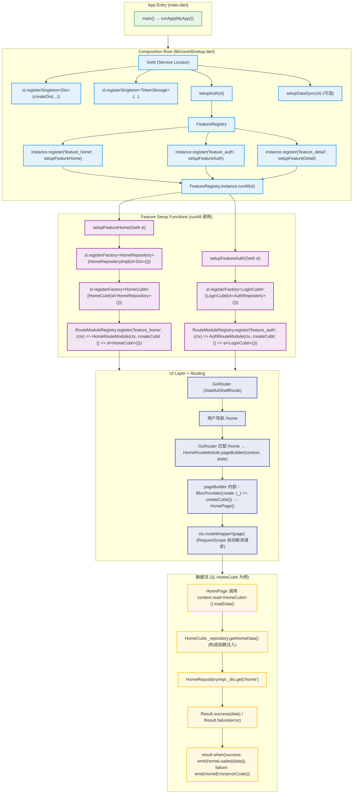

# DI 注入流程与数据流

## 架构全景



## GetIt 的作用

GetIt 是 **Service Locator**（服务定位器），在这个项目中的定位：

```
┌─────────────────────────────────────────────────────────────┐
│  GetIt (Service Locator)                                     │
│                                                              │
│  ✓ 唯一真相：所有共享依赖的唯一注册点和获取点                   │
│  ✓ 生命周期管理：singleton / factory / lazySingleton          │
│  ✓ 依赖解析：通过 sl<T>() 按类型获取已注册的实例               │
│                                                              │
│  注册方式：                                                    │
│  - registerSingleton<T>(factory) → 全局唯一，立即创建          │
│  - registerFactory<T>(factory)   → 每次 sl<T>() 创建新实例     │
│  - registerLazySingleton<T>(f)   → 首次调用时创建              │
│                                                              │
│  使用场景：                                                    │
│  - Composition Root (setup.dart) → 编排所有依赖               │
│  - Feature setup functions       → 注册 feature 级依赖        │
│  - ❌ Feature route/page 中禁止直接 GetIt.instance<T>()       │
└─────────────────────────────────────────────────────────────┘
```

## Feature 如何利用 Repository / UseCase

```
Feature 内部依赖方向：

  HomePage (UI Layer)
    │
    │  context.read<HomeCubit>()  ← BlocProvider 注入
    ▼
  HomeCubit (State Management)
    │
    │  构造函数注入: HomeCubit(this._repository)
    ▼
  HomeRepository (抽象接口)
    │
    │  构造函数注入: HomeRepositoryImpl(this._dio)
    ▼
  Dio HTTP Client → API 请求
```

**关键原则：**
- **Feature 不直接访问 GetIt** — 所有依赖通过构造函数注入
- **Repository 是接口** — Feature 依赖抽象，不依赖具体实现
- **Cubit 是桥梁** — UI 通过 BlocProvider 获取 Cubit，Cubit 通过构造函数获取 Repository
- **RouteModule 是胶水层** — setup.dart 通过闭包 `createCubit: () => sl<XxxCubit>()` 把 GetIt 解析延迟到路由构建时
